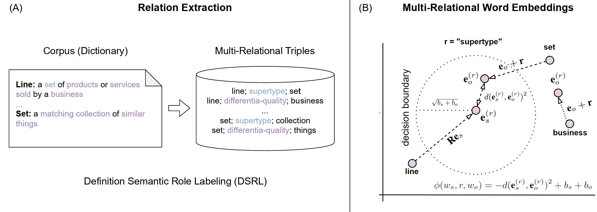

# Multi-Relational Hyperbolic Word Embeddings from Natural Language Definitions (EACL 2024 - Main Track)

Natural language definitions possess a recursive, self-explanatory semantic structure that can support representation learning methods able to preserve explicit conceptual relations and constraints in the latent space. This paper presents a multi-relational model that explicitly leverages such a structure to derive word embeddings from definitions. By automatically extracting the relations linking defined and defining terms from dictionaries, we demonstrate how the problem of learning word embeddings can be formalised via a translational framework in Hyperbolic space and used as a proxy to capture the global semantic structure of definitions. An extensive empirical analysis demonstrates that the framework can help imposing the desired structural constraints while preserving the semantic mapping required for controllable and interpretable traversal. Moreover, the experiments reveal the superiority of the Hyperbolic word embeddings over the Euclidean counterparts and demonstrate that the multi-relational approach can obtain competitive results when compared to state-of-the-art neural models, with the advantage of being intrinsically more efficient and interpretable.

Full paper: https://arxiv.org/abs/2305.07303
Video presentation: https://youtu.be/cu8AcRFZ-3w?si=mMEHm7qNTuTKmCxU



# Reproducibility

Welcome! :) 

In this repository, you can find the code to reproduce the results presented in our EACL 2024 [paper](https://arxiv.org/abs/2305.07303).

The code for training the multi-relational embeddings is adapted from the [Multi-relational Poincaré Graph Embeddings](https://github.com/ibalazevic/multirelational-poincare) repository.

**Training Multi-Relational Word Embeddings:**

To train the euclidean embeddings, run the following command:

`CUDA_VISIBLE_DEVICES=0 python ./multi_relational_training.py --model euclidean --dataset cpae --num_iterations 300 --nneg 50 --batch_size 128 --lr 50 --dim 300`

To train the hyperbolic embeddings, run the following command:

`CUDA_VISIBLE_DEVICES=0 python ./multi_relational_training.py --model poincare --dataset cpae --num_iterations 300 --nneg 50 --batch_size 128 --lr 50 --dim 300`

**Evaluation:** 

Once trained, the embeddings can be evaluated running `./evaluate_similarity.py` and `./evaluate_similarity_poincare.py`.

**Baselines:** 

The script `./sentence_bert_baseline.py` contains the code to evaluate the [Sentence-Tansformer](https://www.sbert.net/docs/pretrained_models.html) models.  

**Definition Semantic Roles:** 

The pre-trained distilbert annotator used in our work can be downloaded via `./models/get_annotators.sh`.

Alternatively, you can access the model and the dataset adopted for training the semantic annotator [here](https://drive.google.com/drive/folders/12nJJHo7ryS6gVT-ukE-BsuHvAqPLUh3S).

The full set of automatically annotated definitions and the resulting multi-relational triples for training the embeddings are available in `./data/*`

## Reference
If you find this repository useful, please consider citing our paper!

```
@misc{valentino2024multirelational,
      title={Multi-Relational Hyperbolic Word Embeddings from Natural Language Definitions}, 
      author={Marco Valentino and Danilo S. Carvalho and André Freitas},
      year={2024},
      eprint={2305.07303},
      archivePrefix={arXiv},
      primaryClass={cs.CL}
}
```

For any issues or questions, feel free to contact us at marco.valentino@idiap.ch

